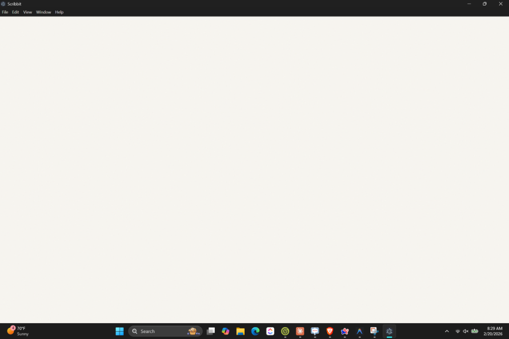

# Scribbit

### Write more. Think *better.*

Scribbit is a beautiful, distraction-free writing application designed to help you overcome the blank page and develop a consistent writing habit. With AI-assisted prompts tailored to your interests, a focused 30-minute timer, and private local storage, Scribbit provides the perfect environment for deep thought and creative expression.



## ✨ Features

- 🧘 **Distraction-Free Interface**: A clean "Paper and Ink" aesthetic that puts your words front and center.
- ✨ **AI Prompted Writing**: Generate thoughtful prompts based on your unique interests (Google Gemini, Anthropic Claude, OpenAI, or Mistral).
- 📖 **Read & Respond**: Paste text or URLs to reflect on and write your responses.
- ⏱️ **30-Minute Sessions**: Focused writing sprints to help you get into a flow state.
- 🔐 **Privacy First**: All your writings and API keys are stored locally on your device. Never synced to a cloud you don't control.
- 📊 **Writing Patterns**: Analyze your writing habits and common themes over time.
- 📤 **Clean Exports**: Export your sessions as beautifully formatted PDFs or plain text.

## 🚀 Getting Started

### Prerequisites
- [Node.js](https://nodejs.org/) (v16 or higher)
- An API key from a supported provider (Gemini, Anthropic, OpenAI, or Mistral)

### Installation
1. Clone the repository:
   ```bash
   git clone https://github.com/justsaydidi/Scribbit.git
   cd Scribbit
   ```
2. Install dependencies:
   ```bash
   npm install
   ```
3. Start the application:
   ```bash
   npm start
   ```

## 🛠️ Built With
- [Electron](https://www.electronjs.org/)
- Vanilla JavaScript & CSS
- AI SDKs (Anthropic, Google, Mistral, OpenAI)

## 📄 License
This project is licensed under the MIT License - see the [LICENSE](LICENSE) file for details.

## 🤝 Contributing
Contributions are welcome! Please feel free to submit a Pull Request.

---
Built with ❤️ for writers.
